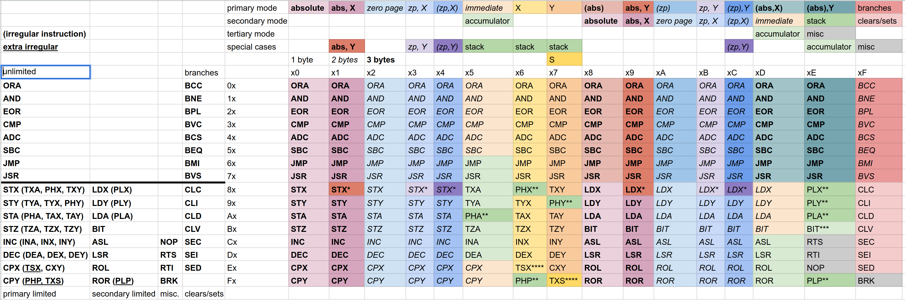

#  rust 6502 emulator and assembler

This was just a little project to get back into coding more frequently.

**Do not use this project in production code**

## reorganization

tried my hand at reorganizing the 6502 opcodes


first of all, the goals for this project are arbitrary and emotional. I just found myself frustrated with some of the strange decisions that were made for the opcodes, I'm sure there were reasons for all of them, this is for fun.

Goals:

- Create most functionality possible without straying far from original design
- Make rules for determining behavior simple
- Make the table look prettier
- Don't worry about leaving room for futureproofing because that feels hard
- In fact, fill out the whole address space

[Spreadsheet](https://docs.google.com/spreadsheets/d/e/2PACX-1vRvVaSI80LN8ZKo1b-XaSaV4YMD5VVVtm9c1_yJoy8foDK-HCUhdIizXOdTDTOwh8PQ406uLyA0suNF/pubhtml?gid=657397901&single=true)




### Things I did that I like
An instruction can usually be figured out by looking at it in hex. The first hex digit (primarily) determines the instruction (I call it the code), the second digit (primarily) determines the addressing mode (I call it the mode). This also means that different modes of the same instruction are always sequential.(**) (****) I grouped instructions that are friends closer together visually and hexwise. Except for mode xF, code 0x,1x,2x will always be bitwise operations, 4x and 5x will always be adds and subtracts, 6x and 7x will always be jumps, and 8x,9x,Ax will always be stores and loads of a predictable register (X,Y,A respectively). I also just noticed Ax is STA and LDA which is kind of fun!

Partially due to this, and due to that codes 8x-Fx are split into two main instructions clean down the middle, there's a number of bitmasks that can be used to determine properties about in instruction. (down to some exceptions)
```
- 10bb0bbb -> store
- 110b0bbb -> increment/decrement
- 111b0bbb -> compare x/y (**) (****)
- 111b0110 -> stack pointer transfer
- bbbbb00b -> absolute-related addressing mode

except mode xF bbbb1111:

- 00bbbbbb -> bitwise operation (except CMP 0011bbbb)
- 010bbbbb -> add/subtract
- 011bbbbb -> jump
- 10bb1bbb -> load (except BIT 10111bbb)
- 10bbbbbb -> store/load (except BIT 10111bbb)

in mode xF bbbb1111, except BRK FF 11111111:

- 0bbb -> branch
- 1bbb -> set/clear
- 10bb -> clear
- 11bb -> set (bit 6 determines desired state of flag)
- bb00 -> carry flag
- bb11 -> overflow flag
- 0b01 -> zero flag
- 1b01 -> interrupt flag
- 0b10 -> negative flag
- 1b10 -> decimal flag
```
Let's talk about addressing modes. the 6502 broke its modes up into 3 groups, so that it could give different amounts of modes to different opcodes. I have done my best to honor and expand the repertoire in a nice symmetrical way.

unlimited instructions take up 15 addressing modes and begin with a 0. xF unlimited is reserved for branch instructions. These are for math, bitwise operations, and jumps.

limited instructions start with a 1. primary limited instructions take up 8 addressing modes and look like `1bbb0bbb`. (**) (****) secondary limited instructions take up 6 addressing modes (7 including pulls) and look like `1bbb1bbb`. xF limited is reserved for clears, sets, and `BRK FF`.

for all instructions the first 6 modes are absolute, absolute + x, zero page, zero page + x, indirect (zero page + x), and immediate/accumulator.* [explanation of these terms](https://www.nesdev.org/obelisk-6502-guide/addressing.html)

for unlimited and primary limited, the 7th and 8th (`x6` and `x7`) modes are X and Y modes. these modes did not exist on the 6502, and they allow us to do things like directly add y to the accumulator, which as far as I can tell, was not possible. It also allows TXA, TAY, TYA, TAX and the later added TXY and TYX to go in the slots which correspond to storing a register to the register whose mode we're in.

secondary limited instructions only take up 6 addressing modes except for the loads which include pulls from the stack. (imagine ROR as a phantom LDP)

unlimited instructions go on to have indirect and Y-indexed siblings of their first 5 modes, (abs), abs,Y, (zp), zp,Y, (zp),Y, then (abs,X) and (abs),Y. (following in the tradition that X is indexed indirect, and y is indirect indexed)

### compromises and caveats and things I don't like

I would have liked to be able to give the shifts and rotations the X and Y modes so you could directly shift those registers along with the accumulator, but I would have to sacrifice some other instructions. (JMP and JSR don't necessarily need to be able to jump to acc, x, and y, these would be first on the chopping block, but this would make the table uglier and break the satisfying one-row-per-instruction convention)

I would like there to be simpler behavior for determining immediate vs. accumulator (ideally which would apply evenly to all instructions)

### *
Just like in the original instruction set, if loading or storing X in an addressing mode which references X, replace X with Y.

### **
Added new pushes and pulls for X and Y. To push X, Y, or A to the stack, use the `ST_` opcode and mode that would store them to themselves. To pull them from the stack, `LD_` in mode `xE`. PHP and PLP can be conceptualized as if code Fx were `STP` and `LDP`, except since there's no mode that would push the process flags to themselves, PHP goes in the gap left by comparing Y to X (redundant to CXY). PLP is in the correct column, and they differ by only a bit! 

```
PHP F6 11110110
PLP FE 11111110
```

This is also true of PHX and PLX, but only because mode x6 happens to be the X column. Y and ACC don't have this basically useless but deeply satisfying property because their modes are x7 and x5. I just wanted to tell myself there was a good reason.

I kind of wish the pushes were all in one column like the pulls but this would require major reorganization and I like the x and y modes so i needed something fitting to do with `STX X`,` STY Y`, and `STA A`.

### ***
Many instructions don't make sense to use the accumulator mode, and many don't make sense to use immediate. because of this, `bbbbb101` is both immediate mode and accumulator mode depending on the instruction. But `BIT` is a rare instruction that benefits from having both options (and indeed does have both options in later revisions of the 6502) and I had a slot left over, so I shuffled some instructions around so that `BIT` in mode `xE` is accumulator mode.

### ****
`TSX` and `TXS` are awkward instructions to place, so I put them in the gap left by comparing x to itself and y to itself. (gross, ugly hack)